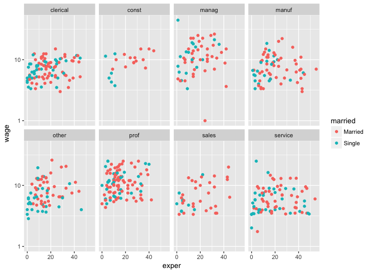

*Source file* 
```{r, results='asis', echo=FALSE}
# includeSourceDocuments()
```


# Exercise 5.4 (DataComputing)

Using the `CPS85` data table, make this graphic: 




# Solution 

```{r include=FALSE}
# We need to install a couple of packages
library(DataComputing)  # includes `scatterGraphHelper()`
library(mosaicData)     # includes the `CPS85` data 
```

```{r, fig.height = 6, fig.width = 9}
ggplot(data=CPS85,aes(x=exper,y=wage))+geom_point()+aes(colour=married)+scale_y_log10()+facet_wrap(~sector,ncol=4) 

```


