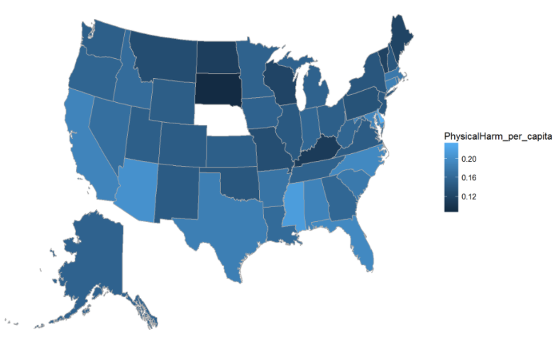
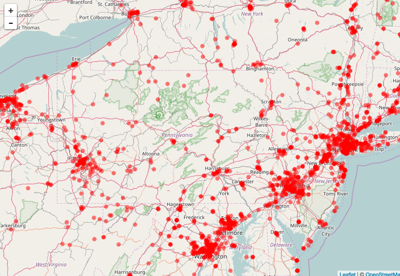

```{r setup, include=FALSE}
library(png)
library(grid)
library(tidyverse)
library(leaflet) 

knitr::opts_chunk$set(echo = FALSE)
```

## Background: Introduction to R (Penn State)  

### Structure

- 1 credit (i.e. one 50 min meeting per week; semester length)
- Reading quiz before class each week  
- Group mini-project began in class each week
- Homework set after class each week
- Final project at end of semester

### Students

- 33 students (3 dropped)
- most did have a STAT course of some kind (including AP)
- 19 had never used R (another 12 had used it "a little")
- Half were not (nor planned to) major in statistics or data science

### Thoughts before, during, and after course

- heavy use of `dplyr`, `ggplot2`, and other `tidyverse` packages (little base R)
- terminology (e.g.,  wrangling, glyph-ready, tidy, pipe)
- included topics completely new to Matt (e.g., scraping HTML tables, leaflets)

## Background: Data Computing (Macalester)  


## Tools: Working code 

- Provide students with concise and consistent framework of commands (& templates)
- Students generally start with working code that they can modify
- Scaffold with interactive tools
    - Inspecting data (`View()`)
    - Visualizations (`xyzGraphBuilder()`)
- interactive commands produce working code that students can then analyze and modify

## Tools: RMarkdown

- advocates common template
    - HTML with embedded Rmd
    - promotes reproducible research habits
    - Students began using it in other STAT classes, and faculty **loved** it
- prevents excessive dependence on interactive commands 
- other document types accessible (LaTeX, slides, etc)

## Tools: Other Resources

- RStudio Cheat Sheets
- DataCamp (full access mid-semester)
- Required weekly ask & answer on Piazza >> class stack exchange

 


## Sample Activities

- Take a few minutes to work through a few examples that illustrate the sort of things students might do in a course like this **without** prerequisites...  
- You will need a laptop connected to the Internet with a current web browser installed  
- Feel free to work in small groups  

### <https://mdbeckman.github.io/USCOTS2017Breakout/>


## PSU Final Project

Instructions were intentionally somewhat vague:  

- Reproducible work (i.e. HTML with embedded .Rmd that runs cold)
- Use real data (not loaded from an R package)
- Data wrangling proficiency
- Visualization proficiency
- High quality code, narrative, and overall product


## 2013 FBI Crime Reporting

- loaded data from [FBI website](https://ucr.fbi.gov/crime-in-the-u.s/2013/crime-in-the-u.s.-2013/tables/table-8/table_8_offenses_known_to_law_enforcement_by_state_by_city_2013.xls/view) 
- basic data wrangling operations: `select()`, `group_by()`, `summarise()`, `mutate()`
- `USMap()` choropleths for comparisons among states 




## Movies in the 21st Century

- scrapes HTML table from [www.the-numbers.com](http://www.the-numbers.com/market/2015/top-grossing-movies)
- basic data wrangling operations: `filter()`, `group_by()`, `summarise()`, `mutate()`
- `ggplot()` graphics exploring relationships among ticket sales, genre, year, studio, etc
- utilized faceting in several places to invite visual comparisons between groups (e.g. MPAA rating)


## FIFA World Rankings Analysis 


- investigate trends among confederations and teams over last 10 years
- scrapes HTML table from [FIFA World Ranking Website](http://www.fifa.com/fifa-world-ranking/ranking-table/men/index.html)  
- wrote `while` loop to utilize an index in the URL to scrape monthly data tables 
- `join` operation adds each monthly table to the master
- reshape data from wide to narrow using `gather()`
- basic data wrangling operations: `select()`, `filter()`, `group_by()`, `summarise()`
- `ggplot()` graphics
- submitted HTML document with embedded .Rmd


## Stanley Cup Winners


- investigating trends and commonalities among Stanley Cup champions
- submitted both LaTeX & HTML with embedded .Rmd
- CSV data sourced from Kaggle
- constructed list containing data frames for champions from 1970 to 2012
- used a `for` loop to iterate over list then create and store `ggplot()` graphic for each champion in a new list
- used `party::ctree()` to build competing models based on recursive partitioning 
- likelihood-based model comparison


## Vegetarian Restaurant Analysis

- exploring trends among restaurants that advertise vegeterian and vegan fare
- basic data wrangling operations: `select()`, `filter()`, `group_by()`, `summarise()`, `mutate()`
- interactive map (i.e. leaflet) shows locations of such restaurants throughout the U.S.

```{r echo=FALSE, include=FALSE}
data <- read.csv("restaurants.csv")

# Student Code
data1<-unique(data) 
data2<-na.omit(data1)

RestaurantMap <-
 leaflet(data2) %>%
 addTiles() %>%
 addCircleMarkers(radius = 2, color = "red") %>%
 setView( lng =-73.935242, lat =40.730610, zoom = 12)  #New York
```

### Student Code
```
data1<-unique(data) 
data2<-na.omit(data1)

RestaurantMap <-
 leaflet(data2) %>%
 addTiles() %>%
 addCircleMarkers(radius = 2, color = "red") %>%
 setView( lng =-73.935242, lat =40.730610, zoom = 12)  #New York

RestaurantMap
```

```{r echo=FALSE}
RestaurantMap
```


## Vegetarian Restaurant Analysis (Static)



- exploring trends among restaurants that advertise vegeterian and vegan fare
- basic data wrangling operations: `select()`, `group_by()`, `summarise()`, `mutate()`
- interactive map (i.e. leaflet) shows locations of such restaurants throughout the U.S.


## Other interesting projects

### History of Reddit

- scrape Reddit data from web
- analysis of new threads over time as well as top Subreddits and SubredditSubs
- used regular expressions to clean text data and identify Subreddits and SubredditSubs

### Leading Causes of Death in NYC

- investigation of leading causes of death in NYC
- investigated Alziemers as well citing familial significance

### Analysis of Thanksgiving

- investigation of survey data about Thanksgiving traditions
- international student studying cultural norms


## Student Outcomes: Core Skills

- data wrangling skills
- data visualization tools
- ability to find answers for themselves

```{r fig.width=10, echo=FALSE}
img3 <- readPNG("images/stat184crop.png")
grid.raster(img3)
```


## Student Outcomes: Broad Exposure

- Data operations
    - Join tables (left, inner, full, anti)
    - Reshape (convert from wide to narrow and back)
    - Work with dates
- Read data from various sources: 
    - HTML tables (e.g. Wikipedia)
    - Yahoo Finance 
    - CSV (web & local)
- Regular expressions
    - identify and/or replace a pattern in a character string
    - extracting patterns
- Basic machine learning
- more graphs
    - incorporate 3rd or 4th variable
    - interactive maps (i.e. leaflets)
    - choropleth maps & leaflets
- Smoothing, confidence bands, etc
- Find their own answers
    - R help
    - published "Cheat Sheets"
    - web forums

## Where to go from here?

### Feel free to revisit some of your initial thoughts about "authentic data science"  

- What should be covered by a meaningful first course in data science?  
- What ambitions do you have for students taking a first data-science course?  
- In what ways should an authentic data-science course differ from intro stats?  

### ..."without prerequisites"  

- What reasonable expectations about students’ abilities and skills coming into the course satisfy “without prerequisites” in the context of your students?
- What computing skills are faithful to the idea of “without prerequisites?”

### ...or maybe consider some new questions

- What are pros/cons of this sort of course?  
- Should such a course have a place within a statistics program (major, minor, concentration, etc)?  

